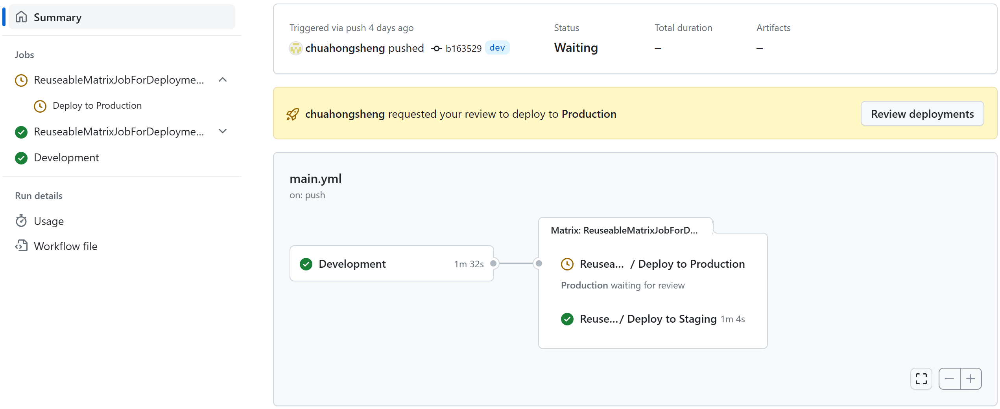
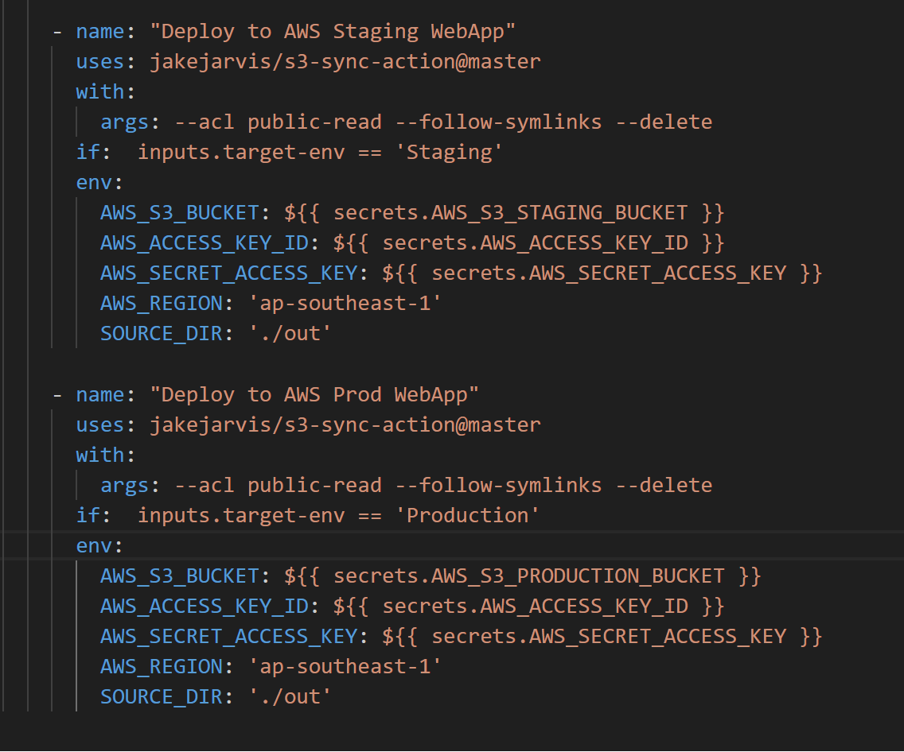
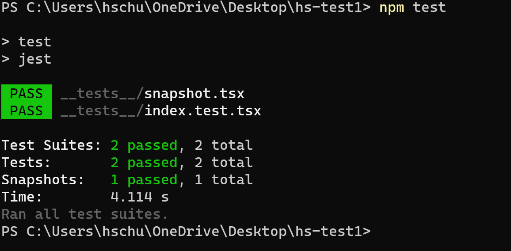
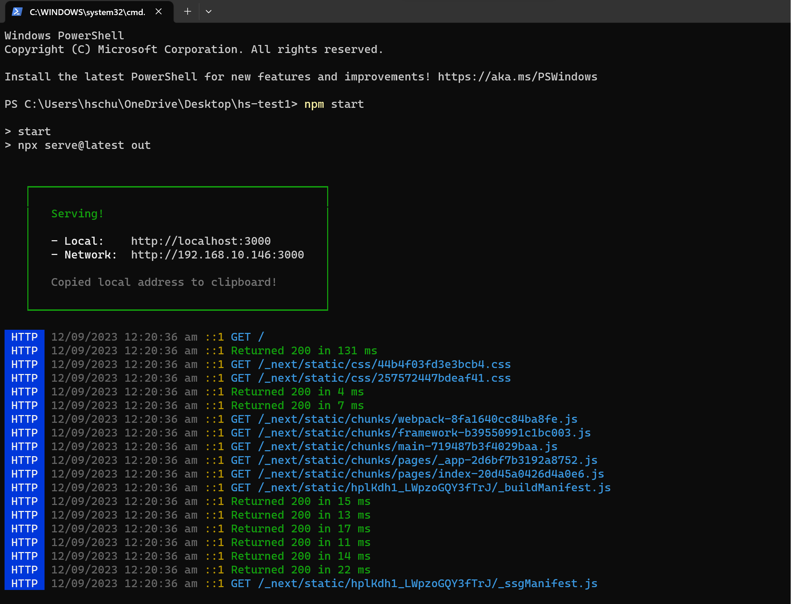
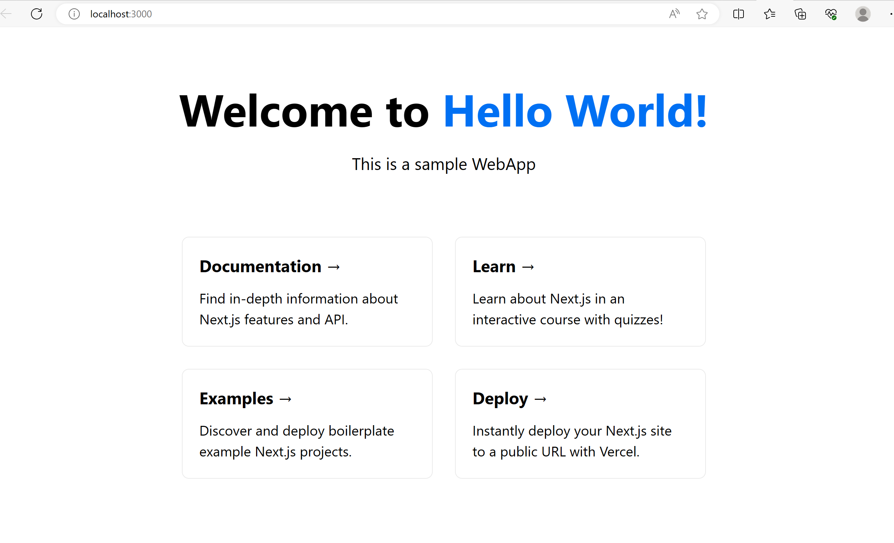
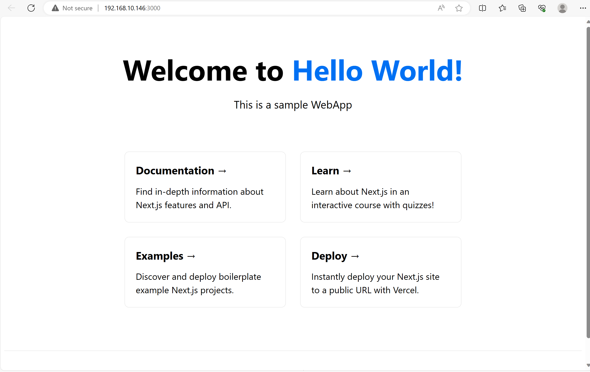

# Group 1 CapstoneProject-DevSecOps-CICDpipeline Multi Enviroment Deployed via Github Actions

## Company Profile
  WebSolve is a company that specializes in creating customized administrative software solutions for various industries and domains. WebSolve helps its clients to solve their business challenges and achieve their goals by designing, developing and deploying tailor-made software applications that meet their specific needs and requirements. WebSolve aims to deliver effective solutions that not only help administrators meet their project/daily tasks, but also ensure data quality and efficiency for data collections. With our digitalization and optimization services, we help our clients streamline their workflows and processes, and make the most of their data. WebSolve’s vision is to become a leading provider of customized software solutions in the asia region.

The application websites will be used to show some use cases and let interested consumers to subscribe to our newletters or contact our friendly staff for more information.
#

## The Team Consist of:
- Chua Hong Sheng
- Guo Enchen
- Julian Lin

---

# Project Description

## Objective

* Deploying a static website on multiple enviroments with Github Actions to AWS S3.
* Changes to website will be automated and deployed to Staging stage first and await reviewer approval on Github. Upon approval, will then be deployed to production stage.

---

## Application Structure

For the deployment workflow, we combined the deployment job into a single YML file.
Over here, we can use **strategy** to create a reuseable matrix job for deployment for best practices. This will also reduce the processing time by Github Actions

## Some of the challenges faced 
* Exporting the static files directly to AWS S3 bucket
* Setting up a isolated runtime enviroment on the unit testing for the website 

## Features that we hope to implement in the future
- Distributing the website on CloudFront

## Running the project
Over here, we will introduce on how to deploy on multiple enviroments with Github Actions. In this case study, we will have several enviroments, eg: **Development**, **Staging**, **Production**. 

We will be using the main yml file to automate the CICD pipeline. In the main workflow file, everytime when code is push to main branch, job will be triggered in the development stage. Development stage will consist of installing dependencies, unit testing, package scanning and upload artifacts for scanning.

Once development build is finished, reuseable maxtrix for deployment will deploy the job to Staging. 
Once Staging enviroment passes, you will see Deploy to Production job pending on the approval from reviewers. 

Reviewers click Approve and deploy will trigger the Production deployment

Deployment yml file (CD pipeline) is used to automatically sync any changes to the static website into the multi enviroments hosted on AWS S3 buckets. 

By running command on CLI *npm test*, the web returns a successful heading

By running command on CLI *npm start*

Local Dev

Production Environment up and running
